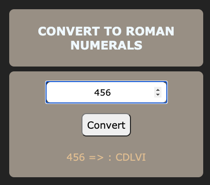

<p> Thanks to Clarusway for this assignment </p>

# JS-CC-006 : Roman Numerals

- Purpose of the this coding challenge is to write a code that given numbers convert to Roman Numerals. The Romans wrote numbers using letters - I, V, X, L, C, D, M. (notice these letters have lots of straight lines and are hence easy to hack into stone tablets).

- Example:

```
1000=M 900=CM 90=XC

2008 is written as MMVIII:

2000=MM 8=VIII
```

## Learning Outcomes

At the end of the this coding challenge, students will be able to;

- Analyze a problem, identify and apply programming knowledge for appropriate solution.

- Demonstrate their knowledge of algorithmic design principles by using JavaScript and Python effectively.

## Problem Statement

- Write a function that takes normal number(` 8, 148, 457` ) and convert to Roman Numerals(` VIII, CXLVIII, CDLVII` )

- Please note that, there is no need to be able to convert numbers larger than about 3000. (The Romans themselves didn't tend to go any higher)

## ScreenShot


## Functions for Javascript and Python
``` javascript
function convertRomans (numEntered) {
    var vNum = [1000, 900, 500, 400, 100, 90, 50, 40, 10, 9, 5, 4, 1];
    var rNum = ['M', 'CM', 'D', 'CD', 'C', 'XC', 'L', 'XL', 'X', 'IX', 'V', 'IV', 'I'];
    var result = "";
    for(i = 0; i < vNum.length; i++) {
        value = parseInt(numEntered/vNum[i]);
        for(j = 0; j < value; j++) {
            result += rNum[i];
        }
        numEntered = numEntered%vNum[i];
    }
    return result;
};
```

``` Python
def int_to_Roman(num):
    val = [1000, 900, 500, 400, 100, 90, 50, 40, 10, 9, 5, 4, 1]
    syb = ["M", "CM", "D", "CD","C", "XC", "L", "XL","X", "IX", "V", "IV","I"]
    roman_num = ''
    i = 0
    while num > 0:
        for _ in range(num // val[i]):
            roman_num += syb[i]
            num -= val[i]
        i += 1
    return roman_num

print('55')
print(int_to_Roman(44))


```


## Website
-  <p align = "left"> <a href = "https://code-code-team.github.io/CC0006J-ROMAN-NUMERALS/" > Visit Romans</a> </p>

---

**<p align="center">&#9786; Happy Coding &#9997;</p>**
